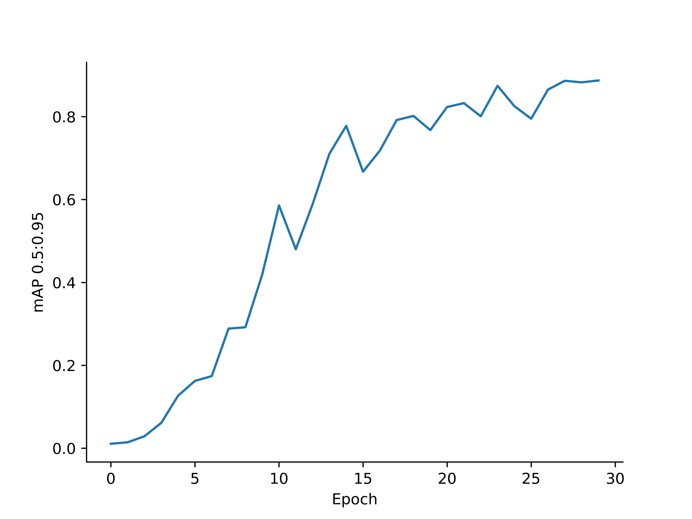

# Dobblenet
A recipe to train YoloV5 to detect items on [dobble](https://www.dobblegame.com/en/games/) cards




# How to train YoloV5 medium to detect icons on Dobble cards

1. Clone the repository
    ```bash
    git clone https://github.com/dobble-org/dobblenet.git
    cd dobblenet
    git submodule update --init --recursive
    ```
1. Create a virtual environment
    ```bash
    python3 -m pip install virtualenv
    python3 -m virtualenv venv
    source venv/bin/activate
    ```

1. Install requirements
    ```bash
    python3 -m pip install -r requirements.txt
    ```
1. Create a `dataset` directory
    ```bash
    mkdir dataset
    ```
1. Download [DobbleSet](https://www.kaggle.com/datasets/atugaryov/dobbleset) to the `dataset` folder. The dataset must be in `dataset/dobbleset`

1. Add `path` field to `dobbleset\data.yaml` with wull path to the dobbleset
1. Run the training:
    ```bash
    python ./yolov5/train.py --img 640 --batch 1 --epoch 30 --data ./dataset/dobbleset/data.yaml --weights yolov5m.pt
    ```
1. The result checkpoints will be in the path: `yolov5/runs/exp{N}/weights/best.pt`

